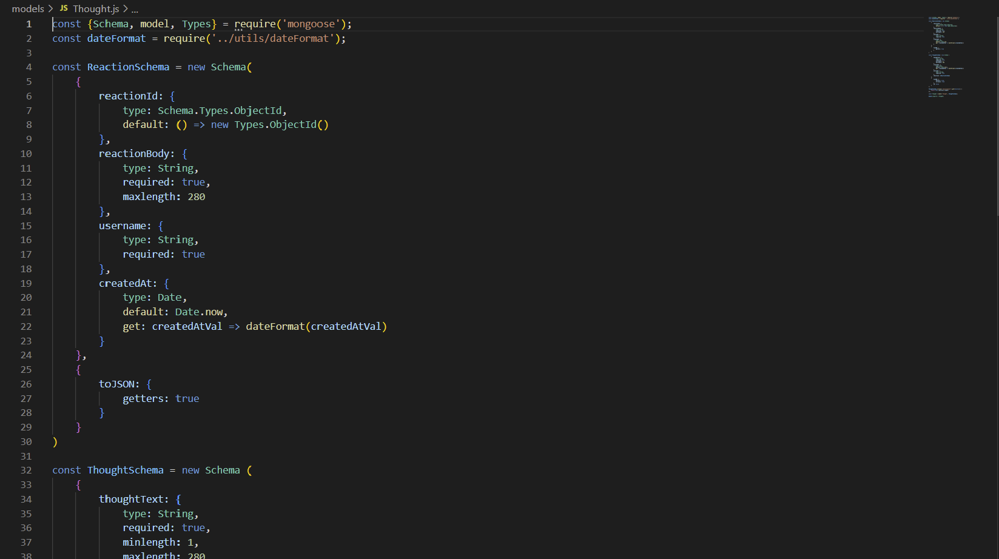

# Social Network API

## Description
This is the back-end for a social network web application. In this application, users can share their thoughts, react to the thoughts of others, and create a friend list. The application utilizes MongoDB for the database, the Mongoose ODM, and Express.js for routing.

## Table of Contents

- [Installation](#installation)
- [Usage](#usage)
- [License](#license)
- [Contributing](#contributing)
- [Tests](#tests)
- [Questions](#questions)

## Installation
To install this project, clone the repo from GitHub onto your local machine. Make sure that you also have Node.js and MongoDB installed and set up

## Usage
To see how to use the API routes, see the following video: https://drive.google.com/file/d/1ahYKMYQO_uxT1k0e7uYP-2cjsfsRuXxm/view?usp=sharing

## License

    This project is licensed under GNU AGPLv3. You can read more about the license here: 
    

## Contributing
I am not looking for contributers on this project

## Tests
There are no dedicated tests for this application, but you can of course try sending different things to the API routes

## Questions
If you would like to contact me with any questions about the application, my GitHub username is PatrickLQuirk and my email is patrickliamquirk@yahoo.com
